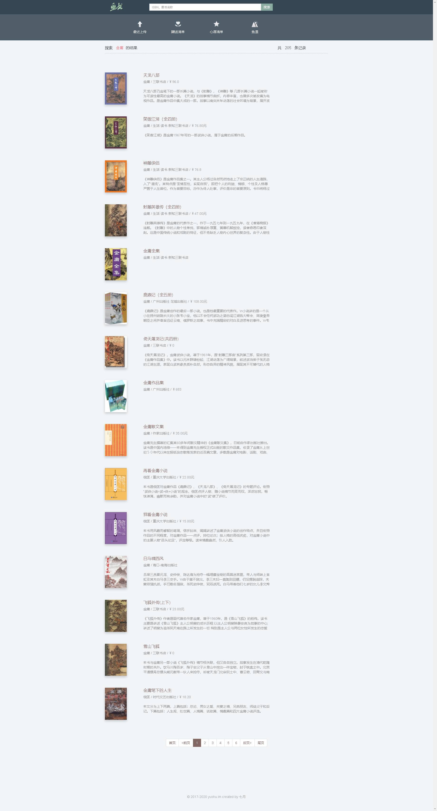
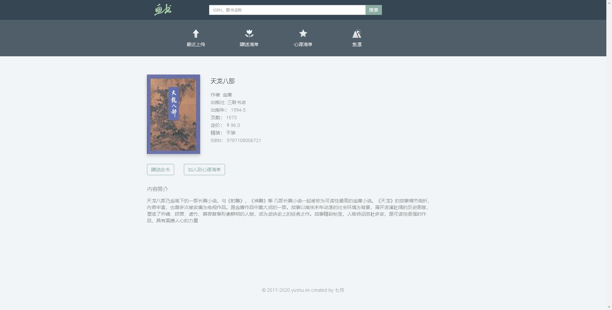
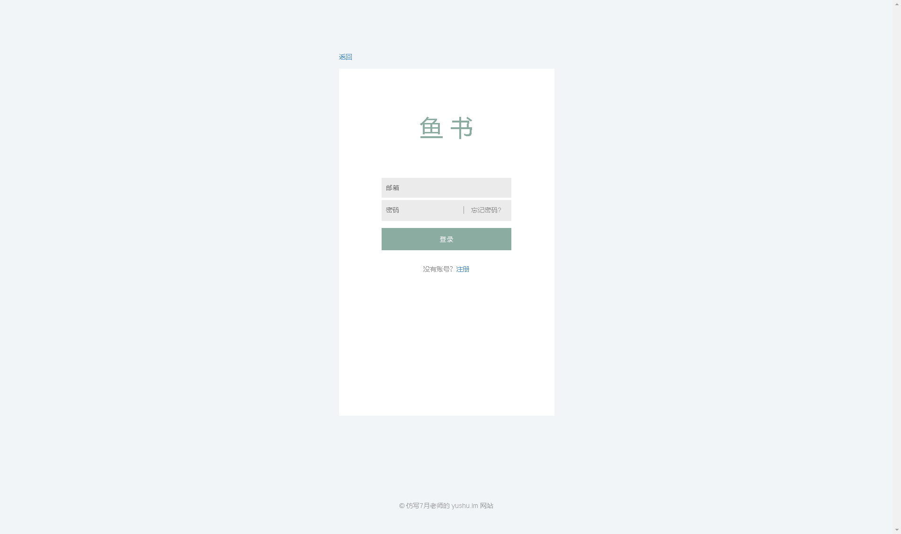
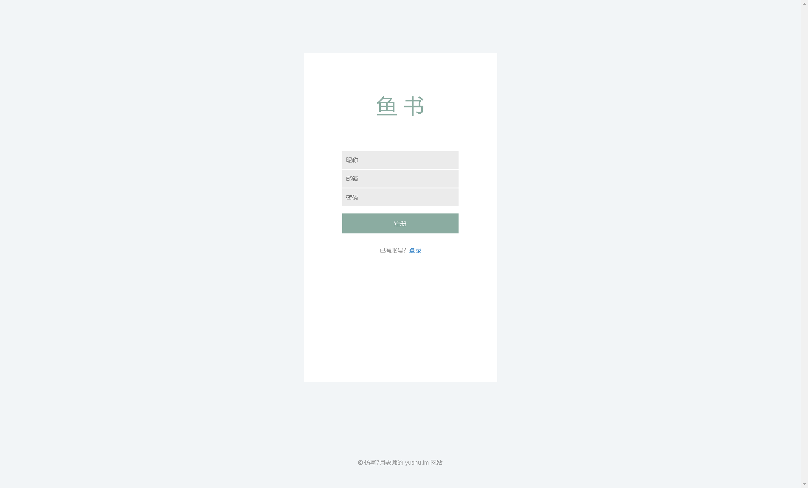

# fisher
鱼书项目的仿写

## tag 标注
你可以根据 tag 看到项目的发展情况
### 0.1 完成 search_book 和 book_detail 页面  
本次 0.1 tag 标注完成的功能并未采用 数据库
1. search_book 页面相关信息  
   - 示例url  
   http://localhost:5000/book/search?q=%E9%87%91%E5%BA%B8   (q=金庸，url进行了encode)
   - 示例结果  
   
   - 补充信息  
     - 每页结果默认采用 page = 15，输出15个结果
     - 数据的路径为 数据从spider中得到，然后经过viewmodel层BookCollection处理，输入到template模板中 

2. book_detail 页面相关信息  
   - 示例url  
   http://localhost:5000/book/9787108006721/detail  
   - 示例结果  
   
   - 补充信息
     - 数据的路径为 数据从spider中得到，然后经过viewmodel层BookViewModel处理，输入到template模板中 

### 0.2 用户系统
#### 0.2.1 完成用户系统中的用户 登录、登出、注册 三个功能
涉及到 User 模型，涉及到 flask-SQLAlchemy 插件的使用（值得注意的是该插件由 flask 官方---pallets 维护，质量可靠）
涉及到 登录、登出问题，涉及到 flask-login 插件的使用  
涉及到 表单验证的工作 需要 wtforms 插件

涉及到表单提交的功能都有 POST 请求
1. 登录页面  
   GET  
   POST
   - 示例url  
   http://127.0.0.1:5000/login
   - 示例结果
   
   
2. 登出
   必须用户登录才能使用登出功能
   - 示例url  
   http://127.0.0.1:5000/logout
3. 注册页面  
   GET  
   POST
   - 示例url  
   http://127.0.0.1:5000/register
   - 示例结果
   

#### 0.2.2 忘记密码
1. 忘记密码
   需要用户提交邮箱，然后向用户提供的邮箱发送一封邮件。  
   忘记密码功能涉及到 flask_mail 插件

### 0.2.3 修改密码
1. 忘记密码 用户使用邮箱链接跳转到修改密码页面
2. 用户处于登录状态，更改密码

## 0.3
### 0.3.1 gift wish 模型
实现了 save to gift 和 save to wish 功能