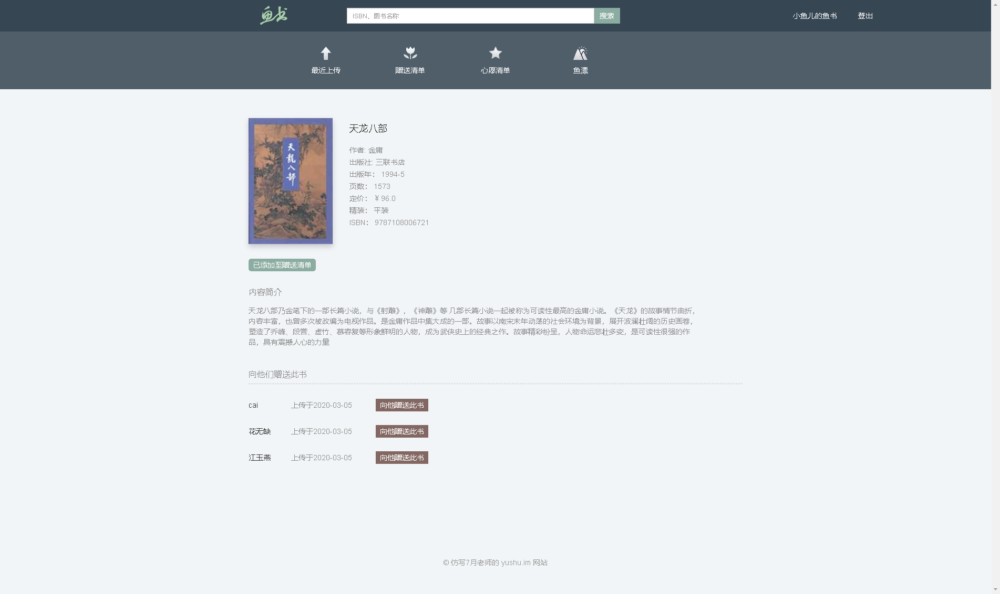
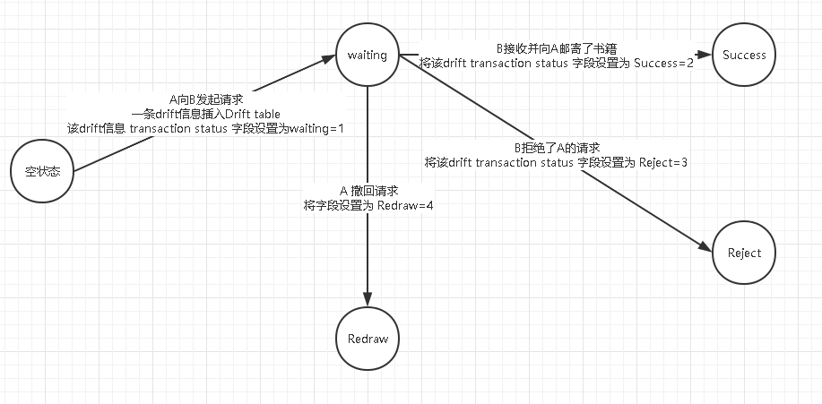

# fisher
鱼书项目的仿写

## tag 标注
你可以根据 tag 看到项目的发展情况
### 0.1 完成 search_book 和 book_detail 页面  
本次 0.1 tag 标注完成的功能并未采用 数据库
1. search_book 页面相关信息  
   - 示例url  
   http://localhost:5000/book/search?q=%E9%87%91%E5%BA%B8   (q=金庸，url进行了encode)
   - 示例结果  
   
   - 补充信息  
     - 每页结果默认采用 page = 15，输出15个结果
     - 数据的路径为 数据从spider中得到，然后经过viewmodel层BookCollection处理，输入到template模板中 

2. book_detail 页面相关信息  
   - 示例url  
   http://localhost:5000/book/9787108006721/detail  
   - 示例结果  
   
   - 补充信息
     - 数据的路径为 数据从spider中得到，然后经过viewmodel层BookViewModel处理，输入到template模板中 

### 0.2 用户系统
#### 0.2.1 完成用户系统中的用户 登录、登出、注册 三个功能
涉及到 User 模型，涉及到 flask-SQLAlchemy 插件的使用（值得注意的是该插件由 flask 官方---pallets 维护，质量可靠）
涉及到 登录、登出问题，涉及到 flask-login 插件的使用  
涉及到 表单验证的工作 需要 wtforms 插件

涉及到表单提交的功能都有 POST 请求
1. 登录页面  
   GET  
   POST
   - 示例url  
   http://127.0.0.1:5000/login
   - 示例结果
   
   
2. 登出
   必须用户登录才能使用登出功能
   - 示例url  
   http://127.0.0.1:5000/logout
3. 注册页面  
   GET  
   POST
   - 示例url  
   http://127.0.0.1:5000/register
   - 示例结果
   

#### 0.2.2 忘记密码
1. 忘记密码
   需要用户提交邮箱，然后向用户提供的邮箱发送一封邮件。  
   忘记密码功能涉及到 flask_mail 插件

### 0.2.3 修改密码
1. 忘记密码 用户使用邮箱链接跳转到修改密码页面
2. 用户处于登录状态，更改密码

## 0.3
### 0.3.1 gift wish 模型
实现了 save to gift 和 save to wish 功能

### 0.3.2 在 book_detail 中显示所有持有本书的人 和 所有想要本书的人
  
当用户未 登录， 默认显示所有持有此书，想赠送此书的人
当用户已登录，此书既不是 gift，也不是wish，默认显示 把此书作为gift 的用户
当用户为 赠送此书人，为该用户显示 所有wish 此书的人
当用户为 wish 此书人，为该用户显示 所有把此书作为 gift 的用户

注册三个账户 xiaoyuer@gmail.com huawuque@gmail.com jiangyuyan@gmail.com  
页面效果如下图所示：

### 0.3.3 
1. recent gift 作为 index 页面
2. 个人用户的  礼物清单  以及    心愿清单

## 4 鱼漂交易模型的建立
目前我们已经根据业务 构建了 User、Gift、Wish 这三个 table  
下面我们考虑一个场景：用户A 向 用户B 请求某一本书  
根据产品需求prd，我们先设计出数据库，最后的工作就是根据需求描写业务逻辑操作数据库即可。  
设计这样的字段作为草图：  

| Requester who want the book 	| Responser who have the book 	| the information of the book 	| transaction status                                                                                                                                                            	|
|--------------------------------	|--------------------------------	|-----------------------------	|-------------------------------------------------------------------------------------------------------------------------------------------------------------------------------	|
| User A id                      	| User B id                      	| Book isbn                   	| Waiting: A lanch the request and wait for B to reponse Sucess: B accept the request and send the book to B Reject: B refuse the request Redraw: A redraw the request 	|

梳理状态转移图能够帮助我们更好的理解 产品需求与数据库之间的关系：  
  
Now things get easy!  
All we need to do is just writing the view functions to implement the transition between states!

1. we are going to write the view function which help User A ask the book from User B  

### 部署
1. 最原始的方式（人工） 
git clone 代码到生产环境，手工pip安装依赖，手工启动 WSGI server，Nginx, Mysql

2. 廖雪峰官网部署方式（自动化部署方案）
使用 fabric、supervisor

3. 使用 ansible 等框架

注：Mysql Nginx 这些服务可以下载安装、也可以安装docker image

### 后记
1. 这个项目还是挺不错的，通过这个项目，对于MVC这种分层模型有了清晰的认识  
2. flask、SQLAlchemy这些目前只能有浅显的认知，要想有更加深入的认识有两个途径
   - 学习相关源码 flask、werkzeug源码
     - 参与到 palletes 这个开源组织中
     - 分享知识给更多的人，你能分享出去的知识才是你所掌握的知识
     - 参与到一个公司级的基于flask的项目中
     - 花部分时间阅读相关新闻
     - 花部分时间阅读相关书籍（书籍再不必跟着做了，学习一下他们解决web问题的精髓即可） 
   - 学习 SQLAlchemy，了解 ORM 模型，其实它就是个中间件
   - 学习 flaks-login 等功能如何实现
   - 最最重要的，学习其他优秀的框架
     - ruby：ruby on rails，ruby china 开发的论坛
     - php：bbs时代的老大，有多款成熟的产品 discuz!、wordpress
     - Java：目前业内公认互联网时代最强 dubbo
   - 微服务、serverless、中台 这些高大上的名词(dogface)，目前只了解 微服务这个 "银弹"(dogface 🐶)
   
完结撒花✿✿ヽ(°▽°)ノ✿